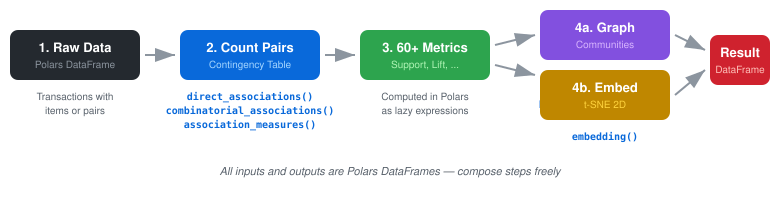
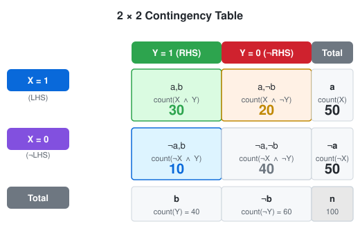
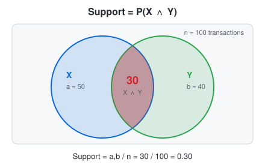
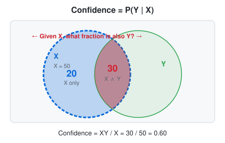
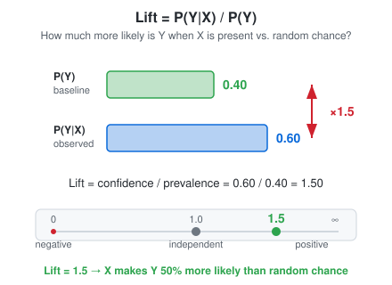
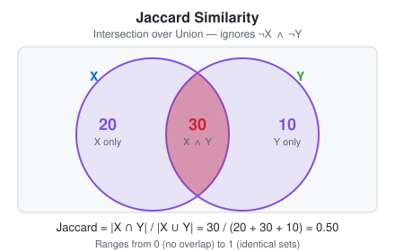
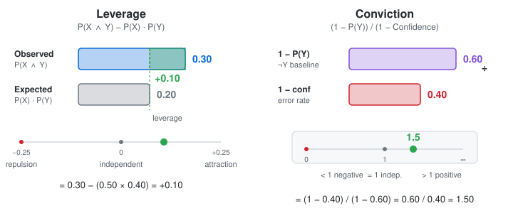
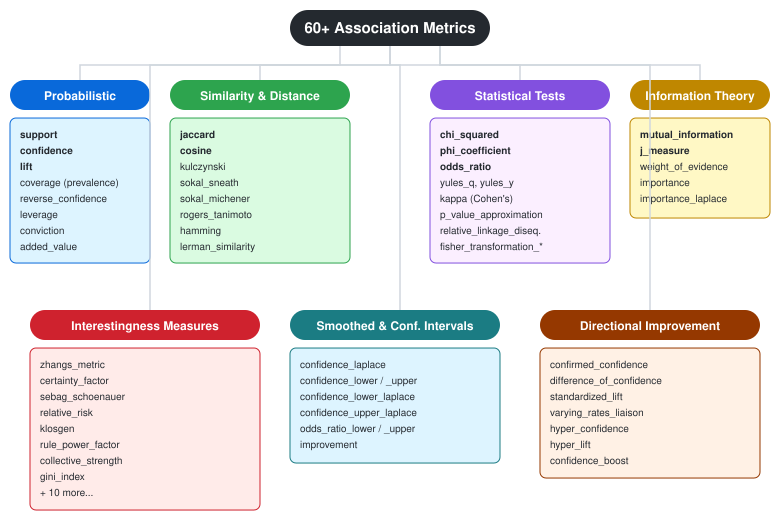

<p align="center">
  
</p>

# Associo

*From Italian "associo" — I associate. A library for discovering associations and connections in data.*

High-performance association analysis library built on [Polars](https://pola.rs/). Computes **60+ association metrics**, performs **graph clustering** and **community detection**, and provides **t-SNE embedding** for visualization.

```bash
pip install git+https://github.com/avpv/associo.git
```

**Requirements:** Python >= 3.10 &nbsp;|&nbsp; **Dependencies:** `polars>=0.20.0`, `networkx>=3.0`, `scikit-learn>=1.3.0`

---

## How It Works

<p align="center">
  
</p>

**All inputs and outputs are Polars DataFrames** — you can compose steps freely in any order.

---

## Table of Contents

1. [The Contingency Table — Foundation of All Metrics](#1-the-contingency-table)
2. [Core Metrics Explained Visually](#2-core-metrics-explained-visually)
   - [Support](#support--px--y)
   - [Confidence](#confidence--pyx)
   - [Lift](#lift--pyx--py)
   - [Jaccard Similarity](#jaccard-similarity)
   - [Leverage & Conviction](#leverage--conviction)
3. [All 60+ Metrics — Complete Reference](#3-all-60-metrics--taxonomy)
4. [Quick Start](#4-quick-start)
5. [API Reference](#5-api-reference)
6. [Graph Algorithms](#6-graph-algorithms)
7. [Embedding & Visualization](#7-embedding--visualization)
8. [Algorithm Parameters](#8-algorithm-parameters)

---

## 1. The Contingency Table

Every metric in Associo is derived from a **2×2 contingency table**. This table counts how often two items (X and Y) appear together and apart across all transactions.

<p align="center">
  
</p>

**How to read it:**

| Cell | Meaning | Example |
|------|---------|---------|
| **XY = 30** | Both X and Y present | 30 orders have both bread and butter |
| **X¬Y = 20** | X present, Y absent | 20 orders have bread but not butter |
| **¬XY = 10** | X absent, Y present | 10 orders have butter but not bread |
| **¬X¬Y = 40** | Neither present | 40 orders have neither |
| **X = 50** | Total transactions with X | bread appears in 50 orders |
| **Y = 40** | Total transactions with Y | butter appears in 40 orders |
| **n = 100** | Grand total | 100 orders total |

> **Throughout this guide**, we use these example values: XY=30, X=50, Y=40, n=100.

---

## 2. Core Metrics Explained Visually

### Support = P(X ∧ Y)

**"How often do X and Y appear together?"**

<p align="center">
  
</p>

Support is the most basic metric — the probability that both X and Y occur in the same transaction. It measures absolute frequency of co-occurrence.

- **Range:** 0 to 1
- **High support** → the pair appears frequently
- **Low support** → rare pair (but may still be interesting!)

---

### Confidence = P(Y|X)

**"When X is present, how often is Y also present?"**

<p align="center">
  
</p>

Confidence is a **conditional probability**. It restricts the universe to only transactions containing X (the dashed circle), then asks: what fraction of those also contain Y?

- **Range:** 0 to 1
- **confidence = 0.60** → 60% of transactions with X also contain Y
- **Asymmetric:** conf(X→Y) ≠ conf(Y→X) in general

> **Pitfall:** High confidence alone doesn't mean X and Y are associated. If Y appears in 95% of all transactions, then conf(X→Y) ≈ 0.95 for *any* X. That's why we need **lift**.

---

### Lift = P(Y|X) / P(Y)

**"How much more likely is Y when X is present, compared to random chance?"**

<p align="center">
  
</p>

Lift compares the **observed** co-occurrence rate to the **expected** rate under independence. It corrects for popularity bias.

| Lift | Interpretation |
|------|---------------|
| **= 1.0** | X and Y are independent (no association) |
| **> 1.0** | Positive association — X makes Y more likely |
| **< 1.0** | Negative association — X makes Y less likely |
| **= 1.5** | Y is 50% more likely when X is present |

---

### Jaccard Similarity

**"What fraction of transactions containing X *or* Y contain both?"**

<p align="center">
  
</p>

Jaccard focuses only on the **union** of X and Y — it completely ignores transactions where neither appears (¬X¬Y). This makes it useful when "absence" is not meaningful (e.g., in large catalogs).

- **Range:** 0 to 1
- **= 0** → no overlap
- **= 1** → identical sets
- **Symmetric:** jaccard(X,Y) = jaccard(Y,X)

**Related similarity metrics:** cosine, kulczynski, sokal_sneath, sokal_michener, rogers_tanimoto, hamming, lerman_similarity

---

### Leverage & Conviction

<p align="center">
  
</p>

**Leverage** = P(X ∧ Y) − P(X)·P(Y) — the difference between observed and expected support. Ranges from −0.25 to +0.25. Zero means independence.

**Conviction** = (1 − P(Y)) / (1 − confidence) — measures the ratio of the expected error rate to the observed error rate. Values above 1 indicate a positive association; ∞ means the rule never fails.

---

## 3. All 60+ Metrics — Taxonomy

<p align="center">
  
</p>

<details>
<summary><b>Full list of all metrics with formulas</b></summary>

### Contingency Table Cells
| Metric | Formula | Description |
|--------|---------|-------------|
| `lhs_not_rhs_count` | X − XY | Transactions with X but not Y |
| `not_lhs_rhs_count` | Y − XY | Transactions with Y but not X |
| `not_lhs_not_rhs_count` | n − X − Y + XY | Transactions with neither X nor Y |

### Probabilistic
| Metric | Formula | Description |
|--------|---------|-------------|
| `support` | XY / n | Joint probability P(X ∧ Y) — how often X and Y co-occur |
| `coverage` | X / n | Marginal probability P(X) — how often X appears |
| `prevalence` | Y / n | Marginal probability P(Y) — how often Y appears |
| `confidence` | XY / X | Conditional probability P(Y\|X) — when X is present, how often is Y? |
| `reverse_confidence` | XY / Y | Conditional probability P(X\|Y) — when Y is present, how often is X? |
| `lift` | confidence / prevalence | How much more likely Y is when X is present vs chance. =1 independent, >1 positive, <1 negative |
| `leverage` | support − coverage × prevalence | Difference between observed and expected support. 0 = independence |
| `conviction` | (1 − prevalence) / (1 − confidence) | How often the rule would be wrong if X and Y were independent. ∞ = never fails |

### Similarity & Distance
| Metric | Formula | Description |
|--------|---------|-------------|
| `jaccard` | XY / (X + Y − XY) | Fraction of the union that is the intersection. Ignores ¬X¬Y |
| `cosine` | support / √(coverage × prevalence) | Normalized dot product similarity. Like lift but dampened |
| `kulczynski` | 0.5 × (confidence + reverse_confidence) | Average of both conditional probabilities. Symmetric |
| `sokal_sneath` | 2·XY / (X + Y) | Double-weighted overlap similarity |
| `sokal_michener` | (XY + ¬X¬Y) / n | Simple matching coefficient — counts all agreements |
| `rogers_tanimoto` | (XY + ¬X¬Y) / (n + X + Y − 2·XY) | Adjusted matching — penalizes disagreements more heavily |
| `hamming` | (X + Y − 2·XY) / n | Fraction of transactions where X and Y disagree (distance metric) |
| `lerman_similarity` | (P(X∪Y) − P(X)·P(Y)) / √(P(X)·P(Y)) | Normalized deviation of union from expected under independence |

### Statistical Tests
| Metric | Formula | Description |
|--------|---------|-------------|
| `chi_squared` | Σ (observed − expected)² / expected | Pearson's χ² test for independence. Higher = stronger association |
| `local_chi_squared` | (support·n − expected)² / expected | Contribution of the (X,Y) cell to χ². Isolates this pair's effect |
| `phi_coefficient` | leverage / √(coverage·(1−coverage)·prevalence·(1−prevalence)) | Normalized χ² for 2×2 tables. Range −1 to +1, like a correlation |
| `odds_ratio` | (XY · ¬X¬Y) / (X¬Y · ¬XY) | Odds of Y with X vs without. Uses Haldane +0.5 correction. Range 0 to ∞ |
| `yules_q` | (OR − 1) / (OR + 1) | Normalized odds ratio. Range −1 to +1 |
| `yules_y` | (√OR − 1) / (√OR + 1) | Alternative normalized OR, more conservative than Yule's Q |
| `kappa` | (observed agreement − expected) / (1 − expected) | Cohen's kappa — agreement beyond chance. Range −1 to +1 |
| `p_value_approximation` | exp(−χ² / 2) | Quick approximate p-value from χ². Useful for ranking, not exact |

### Information-Theoretic
| Metric | Formula | Description |
|--------|---------|-------------|
| `mutual_information` | support × log₂(support / (coverage × prevalence)) | Shared information in bits. 0 = independent |
| `j_measure` | support·log₂(conf/prev) + (coverage−support)·log₂((1−conf)/(1−prev)) | Cross-entropy based rule quality — accounts for confirmation and disconfirmation |
| `weight_of_evidence` | log(P(X\|Y) / P(X\|¬Y)) with Laplace smoothing | Log-odds that Y is evidence for X. Positive = supportive, negative = contradicts |
| `importance` | log₁₀(confidence / (1 − confidence)) | Log-odds of confidence. Range −∞ to +∞, 0 means 50% confidence |

### Interestingness & Rule Quality
| Metric | Formula | Description |
|--------|---------|-------------|
| `added_value` | confidence − prevalence | How much X increases the probability of Y above the baseline |
| `improvement` | confidence − P(Y\|¬X) | How much better the rule X→Y is compared to ¬X→Y |
| `certainty_factor` | (confidence − prevalence) / (1 − prevalence) | Normalized confidence gain. Range −1 to +1, 0 = no gain |
| `zhangs_metric` | (confidence − P(Y\|¬X)) / max(confidence, P(Y\|¬X)) | Directional association. Range −1 to +1, robust to marginal changes |
| `sebag_schoenauer` | confidence / (1 − confidence) | Ratio of positive to negative examples. Higher = stronger rule |
| `relative_risk` | confidence / P(Y\|¬X) | Risk ratio — how much X increases the risk of Y vs absence of X |
| `relative_difference` | (confidence − prevalence) / prevalence | Relative gain in confidence over the base rate |
| `difference_of_confidence` | confidence − P(Y\|¬X) | Absolute difference between conditional probabilities |
| `klosgen` | √support × added_value | Support-weighted added value. Balances frequency and strength |
| `rule_power_factor` | support × confidence | Combined measure of rule frequency and reliability |
| `gini_index` | support × (1 − conf² − (1−conf)²) | How much knowing X reduces uncertainty about Y |
| `collective_strength` | support·(1−support) / ((cov·prev−sup)·(cov+prev−sup)) | Ratio of observed to expected deviations from independence |
| `interestingness` | confidence × reverse_confidence × (1 − confidence) | High when rule is strong in both directions but not trivial |
| `comprehensibility` | log(1 + prevalence) / log(1 + support) | Ratio of RHS complexity to rule complexity. Lower = simpler rule |

### Directional & Specialized
| Metric | Formula | Description |
|--------|---------|-------------|
| `casual_confidence` | 0.5 × (confidence + P(¬Y\|¬X)) | Average of forward rule and contrapositive |
| `casual_support` | P(X∪Y) + (1 − support) | Broad co-occurrence including complementary pairs |
| `confirmed_confidence` | confidence − P(¬Y\|X) | Difference between positive and negative confidence |
| `counter_example_rate` | (XY + ¬XY) / n | Fraction of transactions where Y appears (with or without X) |
| `implication_index` | (support − coverage·prevalence) / √(coverage·prevalence) | Standardized deviation from expected support, like a z-score |
| `lambda` | Goodman-Kruskal's λ | Proportional reduction in prediction error. 0 = no improvement |
| `least_contradiction` | (P(X∪Y) − (1−prevalence) − support) / prevalence | Penalizes contradictory evidence |
| `confidence_boost` | confidence / (confidence − improvement) | Ratio of confidence to the ¬X baseline |
| `lift_increase` | (lift − 1) / prevalence | Lift deviation normalized by prevalence |
| `standardized_lift` | (lift − 1) / (lift + 1) | Bounded version of lift. Range −1 to +1 |
| `varying_rates_liaison` | lift − 1 | Simple deviation from independence. 0 = independent |
| `support_vrl` | support × (lift − 1) | Support-weighted liaison — balances frequency and deviation |
| `imbalance_ratio` | (coverage − prevalence) / (coverage + prevalence − support) | Asymmetry between X and Y frequency. 0 = balanced |
| `hyper_confidence` | confidence / P(¬Y\|X) | Ratio of correct to incorrect predictions |
| `hyper_lift` | confidence / P(Y\|¬X) | How much better X→Y is vs ¬X→Y (same as relative_risk) |
| `relative_linkage_disequilibrium` | D / (D + min) piecewise | Normalized linkage disequilibrium. Range −1 to +1 |

### Fisher Transforms
| Metric | Formula | Description |
|--------|---------|-------------|
| `fisher_transformation_confidence` | 2·arcsin(√confidence) | Variance-stabilizing transform. Useful for statistical comparisons |
| `fisher_transformation_reverse_confidence` | 2·arcsin(√reverse_confidence) | Variance-stabilizing transform of reverse confidence |

### Smoothed & Confidence Intervals
| Metric | Formula | Description |
|--------|---------|-------------|
| `confidence_laplace` | (XY + 2) / (X + 4) | Laplace-smoothed confidence. Handles zero counts gracefully |
| `importance_laplace` | log₁₀(conf_laplace / (1 − conf_laplace)) | Laplace-smoothed importance. Stable for small samples |
| `confidence_lower` | confidence − 1.96 × SE | 95% CI lower bound for confidence |
| `confidence_upper` | confidence + 1.96 × SE | 95% CI upper bound for confidence |
| `confidence_lower_laplace` | conf_laplace − 1.96 × SE_laplace | 95% CI lower bound (Laplace-smoothed) |
| `confidence_upper_laplace` | conf_laplace + 1.96 × SE_laplace | 95% CI upper bound (Laplace-smoothed) |
| `odds_ratio_lower` | exp(ln(OR) − 1.96 × SE_log_OR) | 95% CI lower bound for odds ratio |
| `odds_ratio_upper` | exp(ln(OR) + 1.96 × SE_log_OR) | 95% CI upper bound for odds ratio |

</details>

---

## 4. Quick Start

### Direct Associations

When your data already has LHS/RHS columns (e.g., category→product, query→click):

```python
import polars as pl
from associo import direct_associations

df = pl.DataFrame({
    "product_a": ["bread", "bread", "milk", "eggs"],
    "product_b": ["butter", "milk", "butter", "bread"],
    "order_id":  [1, 2, 3, 4],
})

result = direct_associations(
    df,
    column_lhs="product_a",
    column_rhs="product_b",
    column_tid="order_id",
)
```

### Combinatorial Associations

When each row is one item per transaction — all pairs generated automatically:

```python
from associo import combinatorial_associations

basket = pl.DataFrame({
    "product":  ["bread", "butter", "milk", "bread", "milk", "eggs"],
    "order_id": [1, 1, 1, 2, 2, 2],
})

result = combinatorial_associations(
    basket,
    column_items="product",
    column_tid="order_id",
)
```

### From Pre-Aggregated Counts

When you already have the contingency table counts:

```python
from associo import association_measures

counts = pl.DataFrame({
    "lhs": ["bread"],
    "rhs": ["butter"],
    "lhs_rhs_count": [150],
    "lhs_total_count": [500],
    "rhs_total_count": [300],
    "total_count": [1000],
})

result = association_measures(counts)

# Or compute only specific metrics:
result = association_measures(counts, measures=["support", "confidence", "lift"])
```

---

## 5. API Reference

| Function | Description |
|---|---|
| `direct_associations` | Association metrics from pre-paired lhs/rhs data |
| `combinatorial_associations` | All item-pair combinations within transactions |
| `association_measures` | 60+ metrics from pre-aggregated counts |
| `clusters` | Affinity Propagation clustering |
| `communities` | Louvain community detection |
| `label_propagation` | Fast label propagation |
| `connected_components` | Connected components |
| `maximal_cliques` | All maximal cliques |
| `k_clique_communities` | K-clique percolation |
| `label_propagation_overlapping` | SLPA-based overlapping communities |
| `embedding` | t-SNE 2D projection from distance matrix |

---

## 6. Graph Algorithms

Build graphs from association metrics and discover structure:

```python
from associo import clusters, communities, label_propagation

similarity = pl.DataFrame({
    "item_a": ["A", "A", "B", "C"],
    "item_b": ["B", "C", "C", "D"],
    "sim":    [0.8, 0.3, 0.7, 0.9],
})

# Affinity Propagation
cl = clusters(similarity, column_lhs="item_a", column_rhs="item_b", column_similarity="sim")

# Louvain communities
comm = communities(similarity, column_lhs="item_a", column_rhs="item_b", column_similarity="sim")

# Fast label propagation
lp = label_propagation(similarity, column_lhs="item_a", column_rhs="item_b", column_similarity="sim")
```

---

## 7. Embedding & Visualization

Project items into 2D space based on their pairwise distances:

```python
from associo import embedding

distances = pl.DataFrame({
    "item_a": ["A", "A", "B"],
    "item_b": ["B", "C", "C"],
    "dist":   [0.2, 0.7, 0.3],
})

coords = embedding(distances, column_lhs="item_a", column_rhs="item_b", column_distance="dist")
# Returns DataFrame with columns: item, x, y
```

---

## 8. Algorithm Parameters

| Algorithm | Parameter | Default | Effect |
|---|---|---|---|
| Affinity Propagation | `cluster_preference_factor` | 50 | 0–100; lower = fewer larger clusters |
| Louvain | `community_resolution` | 1.0 | Higher = more communities (0.5–2.0) |
| Maximal Cliques | `min_clique_size` | 3 | Minimum clique size to return |
| Maximal Cliques | `min_edge_weight` | 0.1 | Edge weight threshold |
| K-Clique | `k` | 3 | Clique size for percolation |
| K-Clique | `min_edge_weight` | 0.1 | Edge weight threshold |
| Connected Components | `min_edge_weight` | 0.0 | Edge weight threshold |
| Label Propagation | `min_edge_weight` | 0.0 | Edge weight threshold |
| SLPA Overlapping | `n_iter` | 20 | Propagation iterations |
| SLPA Overlapping | `threshold` | 0.1 | Label inclusion threshold (0–1) |
| t-SNE | `perplexity` | 30 | 5–50; local vs global structure |
| t-SNE | `n_iter` | 1000 | Iterations (1000–2000) |

---

## Project Structure

```
├── src/associo/
│   ├── __init__.py          # Public API
│   ├── measures.py          # 60+ association metrics (Polars expressions)
│   ├── associations.py      # Direct & combinatorial association extraction
│   ├── graph.py             # Clustering, communities, cliques, components
│   ├── embedding.py         # t-SNE dimensionality reduction
│   └── _validation.py       # Input validation
├── tests/
│   ├── test_measures.py
│   ├── test_associations.py
│   ├── test_graph.py
│   ├── test_embedding.py
│   ├── test_formulas.py
│   └── test_validation.py
└── pyproject.toml
```

## Development

```bash
pip install -e ".[dev]"
pytest
```

## License

MIT
